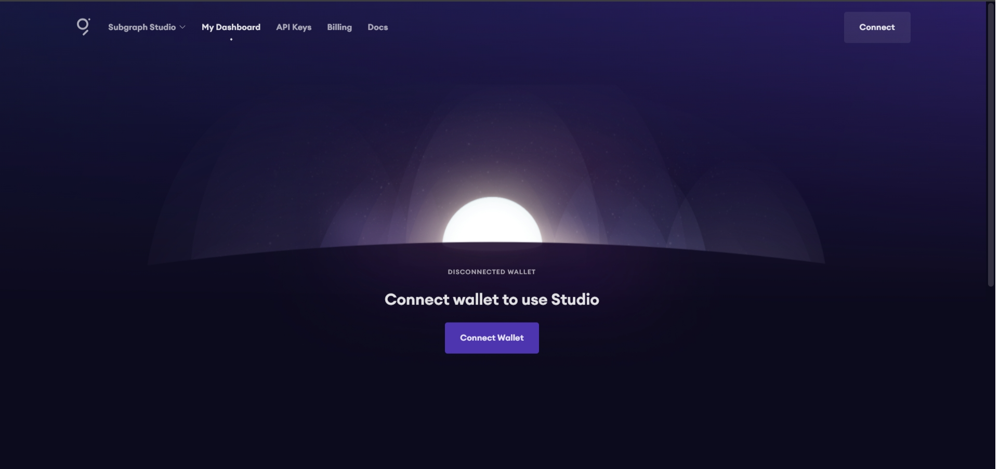
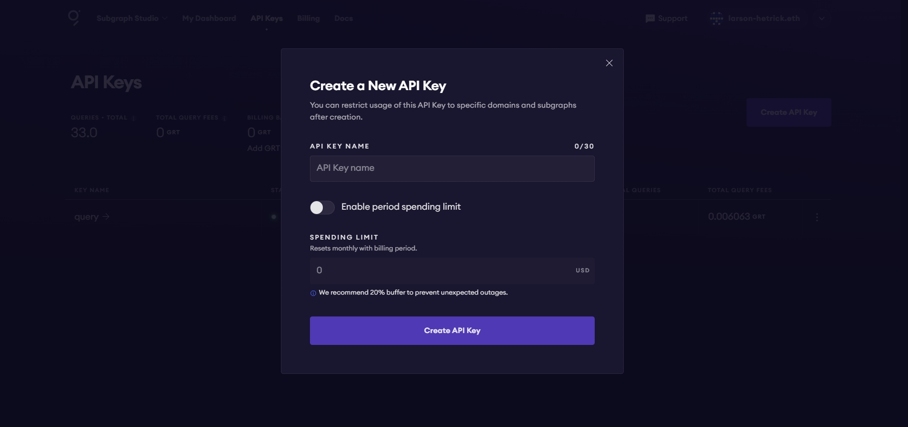

# Uniswap Top Trades Query: Fetch and Analyze Top Trades on Arbitrum
  
This project contains a script to query the top 10 trades by volume on the Uniswap V2 subgraph using [The Graph API](https://thegraph.com/). This information can be used for market analysis, trading strategies, and understanding liquidity flows.

## Table of Contents

1. [Project Overview](#project-overview)
2. [Why This Query is Useful](#why-this-query-is-useful)
3. [Querying the Uniswap Subgraph](#querying-the-uniswap-subgraph)
4. [Subgraph to Query](#subgraph-to-query)
5. [Getting an API Key](#getting-an-api-key)
6. [Installation](#installation)
8. [Running the Script](#running-the-script)
9. [Example Output](#example-output)
10. [Error Handling and Troubleshooting](#error-handling-and-troubleshooting)
11. [Advanced Configuration](#advanced-configuration)
12. [Contributing](#contributing)
13. [References](#references)

## **Project Overview**

This project provides a script to query and analyze the top 10 trades by volume on the Uniswap V2 platform deployed on the Arbitrum network. It leverages [The Graph API](https://thegraph.com/) to fetch data from the Uniswap V2 subgraph. The primary components of the project include:
- `Node.js`: A JavaScript runtime used to run the script.
- `Axios`: A promise-based HTTP client for making requests to The Graph API.
- `Dotenv`: A module to manage environment variables securely.

### **Architecture**:
- **Script Execution**: Initiated by the user via a command-line interface.
- **API Request**: Axios makes HTTP requests to The Graph API.
- **Data Fetching**: The Graph API returns the top 10 trades data from the Uniswap V2 subgraph.
- **Output**: The script processes and outputs the trade details to the console.

### Why This Query is Useful

Analyzing the top trades by volume enables users to gain insights into the most significant transactions on the Uniswap V2 platform. This information is crucial for:
- **Market Analysis**: Identifying trends and patterns in trading activity, which helps in understanding market dynamics and investor behavior.
- **Trading Strategies**: Developing informed trading strategies by analyzing high-volume trades, which can indicate market sentiment and potential price movements.
- **Liquidity Flows**: Monitoring the movement of liquidity within the Uniswap ecosystem, which is vital for assessing the health and efficiency of the market.

**Real-World Example**:
- A trader could use this data to identify large trades that may impact token prices and adjust their strategy accordingly.

## Querying the Uniswap Subgraph

### Subgraph to Query

The subgraph used in this project is the Uniswap V2 subgraph deployed on the Arbitrum network. A subgraph is a specific dataset that The Graph indexes and makes available for querying via GraphQL. This allows for efficient and flexible data retrieval from decentralized applications.

You can explore the subgraph here: [Uniswap V2 Subgraph on Arbitrum](https://thegraph.com/explorer/subgraphs/EYCKATKGBKLWvSfwvBjzfCBmGwYNdVkduYXVivCsLRFu?view=Query&chain=arbitrum-one)

To query this subgraph from the terminal, use the following URL:
https://gateway-arbitrum.network.thegraph.com/api/[YOUR_API_KEY]/subgraphs/id/EYCKATKGBKLWvSfwvBjzfCBmGwYNdVkduYXVivCsLRFu

### Prerequisites

Ensure you have the following prerequisites before running the script:
- [Node.js](https://nodejs.org/) installed (version 12.x or higher recommended)
- An internet connection to fetch data from The Graph
- A [Graph API key](#getting-an-api-key)

### **Setting Up Node.js**:

If you don't have Node.js installed, follow [this guide](https://nodejs.org/en/download/package-manager/) to set it up for your operating system.


### Getting an API Key

1. Visit [The Graph's Explorer](https://thegraph.com/explorer/).
2. Sign up or log in by selecting the "connect wallet" button in the top right corner of the page to connect your Web3 or Cryptocurrency wallet such as [Coinbase Wallet](https://www.coinbase.com/), [MetaMask](https://portfolio.metamask.io/), [Safe](https://app.safe.global/welcome), or [WalletConnet](https://explorer.walletconnect.com/).
3. Navigate to your dashboard and create a new API key. Copy this key for use in our query. It will remain on your dashboard until you delete it, ensuring easy access if you forget or lose it. You can also create another one if needed.

**Screenshots**:
 

  

**Note**: Each API key has usage limits. Refer to [The Graph's documentation](https://thegraph.com/docs/developer/api-keys) for more details on quotas and limitations.

## Installation

### 1. **Clone the Repository**:
   Open your terminal and run the following commands:
```bash
git clone https://github.com/temichelle13/uniswap-top-trades-query
cd uniswap-top-trades-query
```
**Note**: This will clone the repository to your local machine and navigate into the project's root directory.

### 2. **Install Dependencies**:
```bash
npm install axios dotenv
``` 
This command installs the necessary dependencies: `axios` for HTTP requests and `dotenv` for environment variable management

**Note**: Ensure you run these commands from the root directory of the cloned repository, which we navigated to it the previous step.


### 3. **Set Up Environment Variables**

- **Rename the `.env.example` file**
   -     Locate the `.env.example` file in the root directory of your project.
   -     Rename this file to `.env`.

- **Edit the Environment File**:
   -     Open the `.env` file using a text editor such as Notepad, VS Code, or any other editor of your choice.
   -     Replace the placeholder `[GRAPH_API_KEY]` with your actual API key. Ensure there are no spaces around the equal sign and that the key is accurately copied.

- **Save the Changes**:
   -     Save the `.env` file after editing.

**Sample .env File**:
```bash
GRAPH_API_KEY=your_api_key_here
```

#### Why Use Environment Variables?
*Environment variables allow you to manage configuration settings and sensitive information, like API keys, securely and separately from your source code. This helps to keep your private information and assets safe.*

## Running the Script

Execute the following command to run the script and fetch the top 10 trades by volume from the Uniswap V2 subgraph:
```bash
node query.js
```
The script will output details of the top trades, including trade IDs, transaction IDs, amounts in USD, and trading pairs.

**Interpreting the Results**:
- **Trade ID**: Unique identifier for each trade.
- **Transaction ID**: Identifier for the transaction containing the trade.
- **Amount (USD)**: Value of the trade in USD.
- **Pair**: The trading pair involved in the trade.

**Performance Considerations**:
- The script execution time may vary based on network speed and the size of the data fetched.

  
### *Example Query*

```bash
query TopTrades {
  swaps(first: 10, orderBy: amountUSD, orderDirection: desc) {
    id
    amountUSD
    transaction {
      id
    }
    pair {
      token0 {
        symbol
      }
      token1 {
        symbol
      }
    }
  }
}
`;
```

## Example Output

Upon successful execution, the script will produce an output similar to the following:

```bash
Trade ID: 0x76f2546586ac5b1ba522babaa5fbbd9e65ca2047f39497b6b277a08da35cb152-27
  Transaction ID: 0x76f2546586ac5b1ba522babaa5fbbd9e65ca2047f39497b6b277a08da35cb152
  Amount (USD): 4.3981656918396856e+33
  Pair: Unknown Token / 0xDEV
---------------------------------------
Trade ID: 0x76f2546586ac5b1ba522babaa5fbbd9e65ca2047f39497b6b277a08da35cb152-28
  Transaction ID: 0x76f2546586ac5b1ba522babaa5fbbd9e65ca2047f39497b6b277a08da35cb152
  Amount (USD): 4.3981656918396856e+33
  Pair: USDC / Unknown Token
---------------------------------------
Trade ID: 0x76f2546586ac5b1ba522babaa5fbbd9e65ca2047f39497b6b277a08da35cb152-31
  Transaction ID: 0x76f2546586ac5b1ba522babaa5fbbd9e65ca2047f39497b6b277a08da35cb152
  Amount (USD): 4.3981656918396856e+33
  Pair: ZKLK / Unknown Token
---------------------------------------
Trade ID: 0x76f2546586ac5b1ba522babaa5fbbd9e65ca2047f39497b6b277a08da35cb152-26
  Transaction ID: 0x76f2546586ac5b1ba522babaa5fbbd9e65ca2047f39497b6b277a08da35cb152
  Amount (USD): 4.3981656918396856e+33
  Pair: PALAI / Unknown Token
---------------------------------------
Trade ID: 0x76f2546586ac5b1ba522babaa5fbbd9e65ca2047f39497b6b277a08da35cb152-29
  Transaction ID: 0x76f2546586ac5b1ba522babaa5fbbd9e65ca2047f39497b6b277a08da35cb152
  Amount (USD): 4.3981656918396856e+33
  Pair: TPAD / Unknown Token
---------------------------------------
Trade ID: 0x76f2546586ac5b1ba522babaa5fbbd9e65ca2047f39497b6b277a08da35cb152-32
  Transaction ID: 0x76f2546586ac5b1ba522babaa5fbbd9e65ca2047f39497b6b277a08da35cb152
  Amount (USD): 4.3981656918396856e+33
  Pair: PEPE / Unknown Token
---------------------------------------
Trade ID: 0x76f2546586ac5b1ba522babaa5fbbd9e65ca2047f39497b6b277a08da35cb152-30
  Transaction ID: 0x76f2546586ac5b1ba522babaa5fbbd9e65ca2047f39497b6b277a08da35cb152
  Amount (USD): 4.3981656918396856e+33
  Pair: CRYPT / Unknown Token
---------------------------------------
Trade ID: 0x310307c773fcdbfacc21dba2ed454c48511529cf9e18dfe192f4d98c53bb42de-1
  Transaction ID: 0x310307c773fcdbfacc21dba2ed454c48511529cf9e18dfe192f4d98c53bb42de
  Amount (USD): 4.3981656918396856e+33
  Pair: PEPE / Unknown Token
---------------------------------------
Trade ID: 0xea696c395092e2697212b5de2fbb00a10870286bd9a6e4fe903ca53250c55ab6-0
  Transaction ID: 0xea696c395092e2697212b5de2fbb00a10870286bd9a6e4fe903ca53250c55ab6
  Amount (USD): 1.278864171116066e+18
  Pair: TRIAS / USDC
---------------------------------------
Trade ID: 0x97a6234a8eb09a6f193d1488e94c2262a8e7ee34b0e84afdbdbbe7e2bc1b7739-0
  Transaction ID: 0x97a6234a8eb09a6f193d1488e94c2262a8e7ee34b0e84afdbdbbe7e2bc1b7739
  Amount (USD): 1.2137438260380554e+16
  Pair: $MONG / MING
---------------------------------------
```
## Error Handling and Troubleshooting

### Common Errors

- **Invalid API Key**: Ensure your API key is correctly placed in the `.env` file.
- **Network Issues**: Verify your internet connection and try again.
- **Dependency Issues**: Ensure all dependencies are correctly installed by running `npm install` again.

### Troubleshooting Steps

- Double-check for typos in your `.env` file.
- Ensure Node.js is installed and up-to-date.
- Reinstall dependencies if issues persist.

**Additional Resources**:
- [The Graph API Documentation](https://thegraph.com/docs/)
- [Node.js Troubleshooting Guide](https://nodejs.org/en/docs/guides/debugging-getting-started/)

## Advanced Configuration

### Modifying the Query

To customize the query, edit the `query.js` file. For example, to fetch trades for a different token pair, modify the GraphQL query string accordingly.

**Example**:
```bash
const query = `
{
  trades(first: 10, orderBy: volumeUSD, orderDirection: desc, where: {pair: "0x1234567890abcdef"}) {
    id
    transaction {
      id
    }
    volumeUSD
    pair {
      token0 {
        symbol
      }
      token1 {
        symbol
      }
    }
  }
}
```

### Integration with Other Services

You can extend this project by integrating it with other services such as:
- **[Slack](https://slack.com/)**: Send trade alerts to a Slack channel.
- **Database**: Store trade data in a database for further analysis.

## Contributing

Contributions are always welcome to this project! Please follow these steps to contribute:

1. Fork the repository.
2. Create a new branch for your feature or bug fix.
3. Make your changes and commit them with a detailed message.
4. Push your changes to your forked repository.
5. Submit a pull request to the main repository.

**Code of Conduct**:
Please adhere to our [Code of Conduct](CODE_OF_CONDUCT.md) to ensure a positive and inclusive community.

**Detailed Contribution Guidelines**:
Refer to our [Contributing Guide](CONTRIBUTING.md) for more details on how to contribute.

**Summary**:
- You are free to use, modify, and distribute this project.
- Please include attribution to the original author.

## References

- [The Graph Documentation](https://thegraph.com/docs/)
- [Node.js Documentation](https://nodejs.org/en/docs/)
- [Axios GitHub Repository](https://github.com/axios/axios)
- [Dotenv GitHub Repository](https://github.com/motdotla/dotenv)
                             
**Additional Resources**:
- [Uniswap Documentation](https://uniswap.org/docs/)
- [GraphQL Documentation](https://graphql.org/learn/)
- [Arbitrum](https://arbitrum.io/)
- [Coinbase](https://www.coinbase.com/)
- [MetaMask](https://portfolio.metamask.io/)
- [Safe](https://app.safe.global/welcome)
- [WalletConnect](https://explorer.walletconnect.com/)

## Additional Notes

This project demonstrates how to interact with The Graph's GraphQL endpoint to fetch data from a subgraph. The provided query fetches the top 10 trades by volume from the Uniswap V2 subgraph on the Arbitrum network.

## Dependencies

- `axios:` A promise-based HTTP client for Node.js
- `dotenv:` Module to load environment variables from a .env file

## Repository

Visit the GitHub repository to explore the project.
